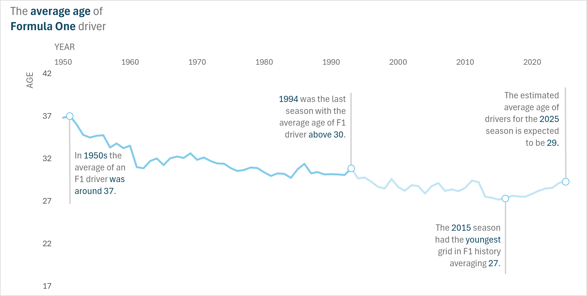
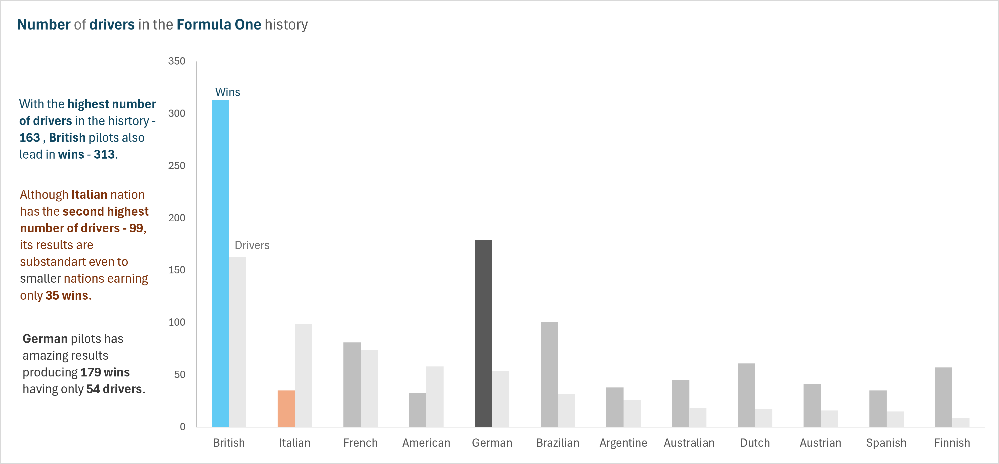

# Overview
This analysis provides insights into various aspects of Formula One history, focusing on driver statistics, the evolution of drivers' ages, and performance trends. The visualizations presented in this project highlight important trends in the sport over time. Primarily focused on explanatory data visualization, this project aims to communicate key findings rather than dive deep into analysis or coding.

The data was sourced from a publicly available dataset on [Kaggle.com](https://www.kaggle.com/datasets/rohanrao/formula-1-world-championship-1950-2020).

# The Questions

These are the questions I answer in my project:

1. How has the average age of Formula One drivers evolved over time, and what are the major trends or shifts?
2. Which countries have produced the most Formula One drivers and the most Formula One winners?
3. Which drivers have achieved the highest points per race on average, and how do their performances compare across recent seasons?

# Tools I Used
For this particular project, I have utilized:

- **PostgreSQL:** The primary database management system, used for storing, querying, and managing the Formula One data.
- **SQL:** The language used to query and analyze the data within the PostgreSQL database, enabling complex data manipulations and calculations.
- **Visual Studio Code:** My development environment for writing and executing SQL queries, managing scripts, and interacting with the database.
- **Excel:** Used for data visualization, creating charts and graphs to present insights effectively.
- **Git & GitHub:** Employed for version control, project management, and sharing the project for collaboration and progress tracking.

# Data Preparation
I have created tables and uploaded my data in PostgreSQL using Visual Studios SQL Tools. The tables had to be created and inserted in the correct order. 
### Coding
```sql
-- Creating Tables based on their values. Every Table should be created in the correct order from. From 1 to 14. 
CREATE TABLE circuits (
    circuitId INT PRIMARY KEY,
    circuitRef VARCHAR(255),
    name VARCHAR(255),
    location VARCHAR(255),
    country VARCHAR(100),
    lat DECIMAL(9, 6),
    lng DECIMAL(9, 6),
    alt INT,
    url VARCHAR(255)
);--1 circuits (no dependencies)

CREATE TABLE constructors (
    constructorId INT PRIMARY KEY,
    constructorRef VARCHAR(50),
    name VARCHAR(100),
    nationality VARCHAR(50),
    url VARCHAR(255)
);--3 constructors (no dependencies)

CREATE TABLE constructor_results (
    constructorResultsId INT PRIMARY KEY,
    raceId INT,
    constructorId INT,
    points DECIMAL(5, 2),
    status VARCHAR(10),
    FOREIGN KEY (constructorId) REFERENCES constructors(constructorId),
    FOREIGN KEY (raceId) REFERENCES races(raceId)
);--7 constructor_results (depends on races and constructors)

CREATE TABLE constructor_standings (
    constructorStandingsId INT PRIMARY KEY,
    raceId INT,
    constructorId INT,
    points DECIMAL(5, 2),
    position INT,
    positionText VARCHAR(10),
    wins INT,
    FOREIGN KEY (constructorId) REFERENCES constructors(constructorId),
    FOREIGN KEY (raceId) REFERENCES races(raceId)
);--8 constructor_standings (depends on races and constructors)

CREATE TABLE drivers (
    driverId INT PRIMARY KEY,
    driverRef VARCHAR(50),
    number INT,
    code VARCHAR(3),
    forename VARCHAR(100),
    surname VARCHAR(100),
    dob DATE,
    nationality VARCHAR(50),
    url VARCHAR(255)
);--4 drivers (no dependencies)

CREATE TABLE driver_standings (
    driverStandingsId INT PRIMARY KEY,
    raceId INT,
    driverId INT,
    points DECIMAL(5, 2),
    position INT,
    positionText VARCHAR(10),
    wins INT,
    FOREIGN KEY (driverId) REFERENCES drivers(driverId),
    FOREIGN KEY (raceId) REFERENCES races(raceId)
);--9 driver_standings (depends on races and drivers)

CREATE TABLE lap_times (
    raceId INT,
    driverId INT,
    lap INT,
    position INT,
    time INTERVAL,
    milliseconds INT,
    PRIMARY KEY (raceId, driverId, lap),
    FOREIGN KEY (raceId) REFERENCES races(raceId),
    FOREIGN KEY (driverId) REFERENCES drivers(driverId)
);--10 lap_times (depends on races and drivers)

CREATE TABLE pit_stops (
    raceId INT,
    driverId INT,
    stop INT,
    lap INT,
    time VARCHAR(20), --needs to be cleaned first. 
    duration DECIMAL(6, 3),
    milliseconds INT,
    PRIMARY KEY (raceId, driverId, stop),
    FOREIGN KEY (raceId) REFERENCES races(raceId),
    FOREIGN KEY (driverId) REFERENCES drivers(driverId)
);--11 pit_stops (depends on races and drivers)

CREATE TABLE qualifying (
    qualifyId INT PRIMARY KEY,
    raceId INT,
    driverId INT,
    constructorId INT,
    number INT,
    position INT,
    q1 VARCHAR(10),
    q2 VARCHAR(10),
    q3 VARCHAR(10),
    FOREIGN KEY (raceId) REFERENCES races(raceId),
    FOREIGN KEY (driverId) REFERENCES drivers(driverId),
    FOREIGN KEY (constructorId) REFERENCES constructors(constructorId)
);--12 qualifying (depends on races, drivers, and constructors)

CREATE TABLE races (
    raceId INT PRIMARY KEY,
    year INT,
    round INT,
    circuitId INT,
    name VARCHAR(255),
    date DATE,
    time TIME,
    url VARCHAR(255),
    fp1_date DATE,
    fp1_time TIME,
    fp2_date DATE,
    fp2_time TIME,
    fp3_date DATE,
    fp3_time TIME,
    quali_date DATE,
    quali_time TIME,
    sprint_date DATE,
    sprint_time TIME,
    FOREIGN KEY (circuitId) REFERENCES circuits(circuitId),
    FOREIGN KEY (year) REFERENCES seasons(year)
);--6 races (depends on circuits and seasons)

CREATE TABLE results (
    resultId INT PRIMARY KEY,
    raceId INT,
    driverId INT,
    constructorId INT,
    number INT,
    grid INT,
    position INT,
    positionText VARCHAR(30),
    positionOrder INT,
    points DECIMAL(7,4),
    laps INT,
    time VARCHAR(30),
    milliseconds VARCHAR(30), --needs to be cleaned first. 
    fastestLap INT,
    rank INT,
    fastestLapTime VARCHAR(30),
    fastestLapSpeed DECIMAL(7, 4),
    statusId INT,
    FOREIGN KEY (raceId) REFERENCES races(raceId),
    FOREIGN KEY (driverId) REFERENCES drivers(driverId),
    FOREIGN KEY (constructorId) REFERENCES constructors(constructorId),
    FOREIGN KEY (statusId) REFERENCES status(statusId)
);--13 results (depends on races, drivers, constructors, and status)

CREATE TABLE seasons (
    year INT PRIMARY KEY,
    url VARCHAR(255)
);--2 seasons (no dependencies)

CREATE TABLE sprint_results (
    resultId INT PRIMARY KEY,
    raceId INT,
    driverId INT,
    constructorId INT,
    number INT,
    grid INT,
    position INT,
    positionText VARCHAR(10),
    positionOrder INT,
    points DECIMAL(5, 2),
    laps INT,
    time VARCHAR(10),
    milliseconds BIGINT,
    fastestLap INT,
    fastestLapTime VARCHAR(10),
    statusId INT,
    FOREIGN KEY (raceId) REFERENCES races(raceId),
    FOREIGN KEY (driverId) REFERENCES drivers(driverId),
    FOREIGN KEY (constructorId) REFERENCES constructors(constructorId),
    FOREIGN KEY (statusId) REFERENCES status(statusId)
);--14 sprint_results (depends on races, drivers, constructors, and status)

CREATE TABLE status (
    statusId INT PRIMARY KEY,
    status VARCHAR(50)
);--5 status (no dependencies)

-- Inserting Data into our tables from CSV files. Every Table should be created in the correct order from. From 1 to 14.
COPY circuits (circuitId, circuitRef, name, location, country, lat, lng, alt, url)
FROM 'D:/SQL Projects Includes Learning/SQL_Project_F1/circuits.csv'
DELIMITER ','
CSV HEADER;--1 circuits (no dependencies)

COPY constructor_results (constructorResultsId, raceId, constructorId, points, status)
FROM 'D:/SQL Projects Includes Learning/SQL_Project_F1/constructor_results.csv'
DELIMITER ','
CSV HEADER;--7 constructor_results (depends on races and constructors)

COPY constructor_standings (constructorStandingsId, raceId, constructorId, points, position, positionText, wins)
FROM 'D:/SQL Projects Includes Learning/SQL_Project_F1/constructor_standings.csv'
DELIMITER ','
CSV HEADER;--8 constructor_standings (depends on races and constructors)

COPY constructors (constructorId, constructorRef, name, nationality, url)
FROM 'D:/SQL Projects Includes Learning/SQL_Project_F1/constructors.csv'
DELIMITER ','
CSV HEADER;--3 constructors (no dependencies)

COPY driver_standings (driverStandingsId, raceId, driverId, points, position, positionText, wins)
FROM 'D:/SQL Projects Includes Learning/SQL_Project_F1/driver_standings.csv'
DELIMITER ','
CSV HEADER;--9 driver_standings (depends on races and drivers)

COPY drivers (driverId, driverRef, number, code, forename, surname, dob, nationality, url)
FROM 'D:/SQL Projects Includes Learning/SQL_Project_F1/drivers.csv'
DELIMITER ','
CSV HEADER
NULL AS '\N';--4 drivers (no dependencies)

COPY lap_times (raceId, driverId, lap, position, time, milliseconds)
FROM 'D:/SQL Projects Includes Learning/SQL_Project_F1/lap_times.csv'
DELIMITER ','
CSV HEADER;--10 lap_times (depends on races and drivers)

COPY pit_stops (raceId, driverId, stop, lap, time, duration, milliseconds)
FROM 'D:/SQL Projects Includes Learning/SQL_Project_F1/pit_stops.csv'
DELIMITER ','
CSV HEADER;--11 pit_stops (depends on races and drivers)

COPY qualifying (qualifyId, raceId, driverId, constructorId, number, position, q1, q2, q3)
FROM 'D:/SQL Projects Includes Learning/SQL_Project_F1/qualifying.csv'
DELIMITER ','
CSV HEADER;--12 qualifying (depends on races, drivers, and constructors)

COPY races (raceId, year, round, circuitId, name, date, time, url, fp1_date, fp1_time, fp2_date, fp2_time, fp3_date, fp3_time, quali_date, quali_time, sprint_date, sprint_time)
FROM 'D:/SQL Projects Includes Learning/SQL_Project_F1/races.csv'
DELIMITER ','
CSV HEADER
NULL AS '\N';--6 races (depends on circuits and seasons)

COPY results (resultId, raceId, driverId, constructorId, number, grid, position, positionText, positionOrder, points, laps, time, milliseconds, fastestLap, rank, fastestLapTime, fastestLapSpeed, statusId)
FROM 'D:/SQL Projects Includes Learning/SQL_Project_F1/results.csv'
DELIMITER ','
CSV HEADER
NULL AS '\N';--13 results (depends on races, drivers, constructors, and status)

COPY seasons (year, url)
FROM 'D:/SQL Projects Includes Learning/SQL_Project_F1/seasons.csv'
DELIMITER ','
CSV HEADER;--2 seasons (no dependencies)

COPY sprint_results (resultId, raceId, driverId, constructorId, number, grid, position, positionText, positionOrder, points, laps, time, milliseconds, fastestLap, fastestLapTime, statusId)
FROM 'D:/SQL Projects Includes Learning/SQL_Project_F1/sprint_results.csv'
DELIMITER ','
CSV HEADER
NULL AS '\N';--14 sprint_results (depends on races, drivers, constructors, and status)

COPY status (statusId, status)
FROM 'D:/SQL Projects Includes Learning/SQL_Project_F1/status.csv'
DELIMITER ','
CSV HEADER;--5 status (no dependencies)
```
# The Analysis
## 1. The Average Age of Formula One Drivers Over Time

### Coding
```sql
SELECT 
    EXTRACT(YEAR FROM races.date) AS year,
    ROUND(AVG(EXTRACT(EPOCH FROM AGE(races.date, drivers.dob)) / (365.25 * 24 * 60 * 60)), 2) AS avg_age_in_years
FROM races
INNER JOIN driver_standings AS ds
ON races.raceid = ds.raceid
INNER JOIN drivers
ON ds.driverid = drivers.driverid
GROUP BY 1
ORDER BY 1 DESC;
```
### Results

This line graph tracks the average age of Formula One drivers across different eras:

* In the 1950s, the average driver was around 37 years old.
* 1994 marked the last season where the average age exceeded 30 years.
* The 2015 season had the youngest grid in F1 history, with an average age of 27.
* The average age for the 2025 season is projected to be around 29 years old, indicating a stable balance in age.

## 2. Number of Drivers and Wins by Nationality
### Coding
```sql
WITH total_drivers AS (SELECT nationality, COUNT(*) AS total_drivers --total number of drivers
FROM drivers
GROUP BY nationality
ORDER BY 2 DESC),


total_wins AS (SELECT nationality, COUNT(*) AS total_wins
FROM races AS r
INNER JOIN driver_standings AS ds
ON r.raceid = ds.raceid
INNER JOIN drivers AS d
ON ds.driverid = d.driverid
WHERE position = 1
GROUP BY 1
ORDER BY 2 DESC) --total number of wins

SELECT tw.nationality, total_wins, total_drivers
FROM total_wins AS tw
INNER JOIN total_drivers AS td
ON tw.nationality = td.nationality
```
### Results

This visualization demonstrates the relationship between the number of drivers from a country and the number of wins achieved by those drivers. Key insights include:

* British dominance: With the highest number of drivers (163) in Formula One history, British drivers also lead by wins (313).
* Italian underperformance: Despite having the second-highest number of drivers (99), Italian drivers have only won 35 races.
* German efficiency: German drivers have achieved an impressive 179 wins with only 54 drivers, showcasing high performance relative to driver count.

## 3. Average Points per Race (2018-2024) for Top Drivers
### Coding
```sql
WITH max_verstappen_stat AS (
    SELECT
        'max_verstappen' AS driver_name,
        EXTRACT(YEAR FROM races.date) AS year, 
        MAX(ds.points) AS max_points, -- We have to use MAX because unfortunately there is no number we can sum :(
        COUNT(*) AS total_races,
        ROUND(MAX(ds.points) / COUNT(*),2) AS points_per_race
    FROM driver_standings AS ds
    INNER JOIN races
    ON ds.raceid=races.raceid
    WHERE ds.driverid = (SELECT driverid
            FROM drivers
            WHERE driverref = 'max_verstappen') 
            AND EXTRACT(YEAR FROM races.date) > 2009 -- Because before 2010 there was another system
    GROUP BY 2
    ORDER BY 4 DESC
),

hamilton_stat AS (
    SELECT
        'hamilton' AS driver_name,
        EXTRACT(YEAR FROM races.date) AS year, 
        MAX(ds.points) AS max_points, -- We have to use MAX because unfortunately there is no number we can sum :(
        COUNT(*) AS total_races,
        ROUND(MAX(ds.points) / COUNT(*),2) AS points_per_race
    FROM driver_standings AS ds
    INNER JOIN races
    ON ds.raceid=races.raceid
    WHERE ds.driverid = ( SELECT driverid
            FROM drivers
            WHERE driverref = 'hamilton') 
            AND EXTRACT(YEAR FROM races.date) > 2009 -- Because before 2010 there was another system
    GROUP BY 2
    ORDER BY 4 DESC
), 

leclerc_stat AS (
    SELECT
        'leclerc' AS driver_name,
        EXTRACT(YEAR FROM races.date) AS year, 
        MAX(ds.points) AS max_points, -- We have to use MAX because unfortunately there is no number we can sum :(
        COUNT(*) AS total_races,
        ROUND(MAX(ds.points) / COUNT(*),2) AS points_per_race
    FROM driver_standings AS ds
    INNER JOIN races
    ON ds.raceid=races.raceid
    WHERE ds.driverid = ( SELECT driverid
            FROM drivers
            WHERE driverref = 'leclerc') 
            AND EXTRACT(YEAR FROM races.date) > 2009 -- Because before 2010 there was another system
    GROUP BY 2
    ORDER BY 4 DESC
), 

sainz_stats AS (
    SELECT
        'sainz' AS driver_name,
        EXTRACT(YEAR FROM races.date) AS year, 
        MAX(ds.points) AS max_points, -- We have to use MAX because unfortunately there is no number we can sum :(
        COUNT(*) AS total_races,
        ROUND(MAX(ds.points) / COUNT(*),2) AS points_per_race
    FROM driver_standings AS ds
    INNER JOIN races
    ON ds.raceid=races.raceid
    WHERE ds.driverid = ( SELECT driverid
            FROM drivers
            WHERE driverref = 'sainz') 
            AND EXTRACT(YEAR FROM races.date) > 2009 -- Because before 2010 there was another system
    GROUP BY 2
    ORDER BY 4 DESC
),

perez_stats AS (
    SELECT
        'perez' AS driver_name,
        EXTRACT(YEAR FROM races.date) AS year, 
        MAX(ds.points) AS max_points, -- We have to use MAX because unfortunately there is no number we can sum :(
        COUNT(*) AS total_races,
        ROUND(MAX(ds.points) / COUNT(*),2) AS points_per_race
    FROM driver_standings AS ds
    INNER JOIN races
    ON ds.raceid=races.raceid
    WHERE ds.driverid = ( SELECT driverid
            FROM drivers
            WHERE driverref = 'perez') 
            AND EXTRACT(YEAR FROM races.date) > 2009 -- Because before 2010 there was another system
    GROUP BY 2
    ORDER BY 4 DESC
),

drivers_age AS (
    SELECT 
        driverref,
        forename,
        surname,
        ROUND(EXTRACT(EPOCH FROM AGE(now(), dob)) / (365.25 * 24 * 60 * 60),1) AS age_in_years
    FROM drivers
    WHERE driverref IN ('max_verstappen', 'hamilton', 'leclerc', 'sainz', 'perez')
)

SELECT *
FROM (SELECT *
    FROM max_verstappen_stat
UNION 
    SELECT * 
    FROM hamilton_stat
UNION 
    SELECT *
    FROM leclerc_stat
UNION
    SELECT *
    FROM sainz_stats
UNION
    SELECT *
    FROM perez_stats) AS union_stat
INNER JOIN drivers_age
ON union_stat.driver_name = drivers_age.driverref
ORDER BY points_per_race DESC
```
### Results

This chart compares the average points per race for top Formula One drivers between 2018 and 2024:

* Hamilton: Consistently performed well with the highest average points per race from 2018 to 2021, peaking at 19.43 in 2018, but showing a decline to 9.17 in 2024.
* Verstappen: Displayed a strong upward trend, climbing from 11.86 points in 2018 to a peak of 21.25 points in 2023, establishing himself as a leading contender.
* Leclerc: Has had more fluctuations, starting at 1.86 points per race in 2018, peaking at 12.5 points per race in 2024, showing steady improvement over time.

# Conclusion
This project provided key insights into Formula One history, focusing on driver nationalities, age trends, and performance metrics. It revealed clear patterns, such as the dominance of British and German drivers in terms of wins, and the shift towards younger drivers in recent years.

The analysis of top drivers like Max Verstappen and Lewis Hamilton highlights how their performance compares to the average driver, showcasing their exceptional race consistency.

There’s still room for further exploration and refinement, with plans to extend the analysis and enhance visualizations. This project sets a solid foundation for continued research into the ever-evolving dynamics of Formula One.
